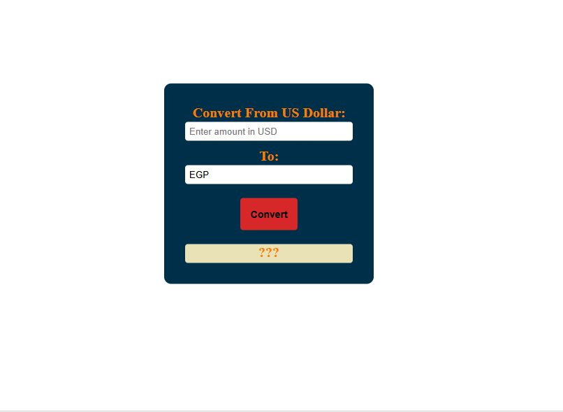

# currency-converter_API
A simple web application to convert currencies using the CurrencyFreaks API. Built with HTML, CSS, and JavaScript.

## Table of contents

- [Overview](#overview)
  - [Usage](#Usage)
  - [Links](#links)
  - [Screenshot](#Screenshot)
- [My process](#my-process)
  - [Features](#Features)
  - [What I learned](#what-i-learned)
  - [Continued development](#continued-development)
- [Author](#author)
- [Acknowledgments](#Acknowledgments)

## overview
The Currency API Converter is a web application designed to help users convert amounts from US Dollars to various other currencies. This project leverages the CurrencyFreaks API to fetch real-time exchange rates and provides a user-friendly interface for performing currency conversions.

## Usage
1. Enter the amount in US Dollars.
2. Select the target currency from the dropdown list.
3. Click the "Convert" button or press the "Enter" key to see the converted amount.

### Links

If you want to open the link in a new tab, you can:

- Press **Ctrl** (or **Cmd** on Mac) while clicking the link.
- Right-click the link and select **Open link in new tab**.

Otherwise, all links will open in the same tab.

- Solution URL: [here](https://github.com/olahasan/currency-converter_API)

- Live Site URL: [here](https://olahasan.github.io/currency-converter_API/)

 ## Screenshot
 

## my-process

## Features
- Convert from US Dollar to various currencies.
- Dynamic currency list fetched from the API.
- Real-time conversion rates.
- User-friendly interface.

## what-i-learned

### API Integration
- **Fetching Data**: I learned how to fetch data from an external API using the `fetch` function in JavaScript.
- **Handling Responses**: I gained experience in handling JSON responses and dynamically updating the DOM based on the data received.

### JavaScript
- **Event Handling**: I improved my skills in adding event listeners and handling user interactions, such as button clicks and keypress events.
- **Modular Code**: I learned the importance of breaking down code into smaller, reusable functions for better readability and maintainability.

### CSS
- **Responsive Design**: I practiced creating responsive layouts using CSS, ensuring the application looks good on different screen sizes.
- **Styling**: I enhanced my understanding of CSS variables and how to use them for consistent styling across the application.

### HTML
- **Semantic HTML**: I learned the importance of using semantic HTML elements to improve the structure and accessibility of the web page.
- **Form Elements**: I gained experience in working with form elements, such as input fields and datalists, to create a user-friendly interface.

### Error Handling
- I learned how to implement error handling to provide better user feedback and improve the robustness of the application.

###### Overall, this project has helped me strengthen my front-end development skills and provided a solid foundation for future projects involving API integration and dynamic content.

## Continued Development
there are several areas where I plan to continue developing and enhancing the project:
- **Multiple Currencies**: Enable conversions between any two currencies, not just from USD to another currency.
- **Graphical Representation**: Add charts and graphs to visually represent exchange rate trends and conversion results.
- **Hosting**: Deploy the application on a web hosting platform to make it accessible to a wider audience.  

### Author

GitHub - @olahasan

### Acknowledgments

I would like to thank the **[Elzero Web School](https://elzero.org/)** for providing this challenge and to the community for their support. and also want to thank the **[CurrencyFreaks](https://currencyfreaks.com/)** for API

